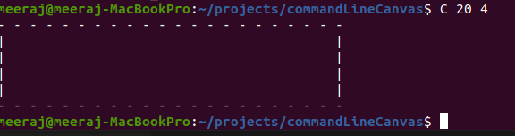
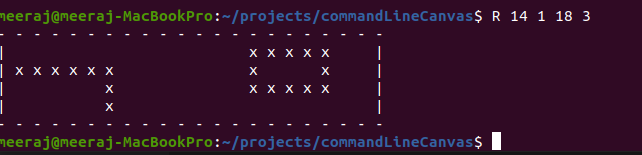

# commandLineCanvas

This is an command line application which helps user to do draw on canvas

## Installation

Use the node package manager to install dependencies.

```bash
npm install
```

## Build

Build application before running by command `npm run build`

```bash
npm run build
```

## UnLink

To Avoid any conflict, please run unlink command before running `npm link`

```bash
npm unlink
```

## Link

```bash
npm link
```

## Commands

> Create Canvas

```bash
C <width> <height>
```

> Draw Line

```bash
L <x1> <y1> <x2> <y2>
```

> Draw Rectangle

```bash
R <x1> <y1> <x2> <y2>
```

> Filler

```bash
B <x> <y> <c>
```

> Quit

```bash
Q
```

## Test cases

```bash
npm run test
```

## Folder Structure

- src/utils contains common methods
- **src/utils**
  - **common.ts**
- **src/wrappers**
  - **withCanvas.ts**
- src/config (Contains Application constants)
- **modules**
  - **create (canvas creation module)**
  - **line (Draw Line module)**
  - **rectangle (Draw Rectangle module)**
  - **filler (Fill canvas module)**
  - **quit (Quit canvas module)**
- **commads**
  - **createCanvas (canvas creation command)**
  - **line (Draw Line command)**
  - **rectangle (Draw Rectangle command)**
  - **fill (Fill canvas command)**
  - **quit (Quit canvas command)**
- test cases are defined along with the src file

## Implementation docs

1). `commands file` under `commands` folder are link to `bin`.
2). All commands description/handling written inside commands folder
3). All logical code files are under `modules` folder.
4). For test cases I am using Jest. You can see all test cases written in parallel with source file

## Scenarios Handles

1). User can only draw verticle and horizontal line
2). In order to fill x and y position should not be filled with any line or rectangle

## Scenarios Not Handles

1). Overlaping is not restricted


## Test cases successfull execution


## Console Screenshot






